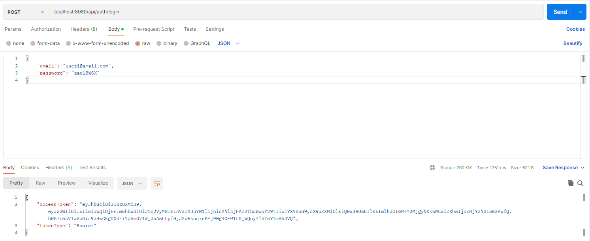
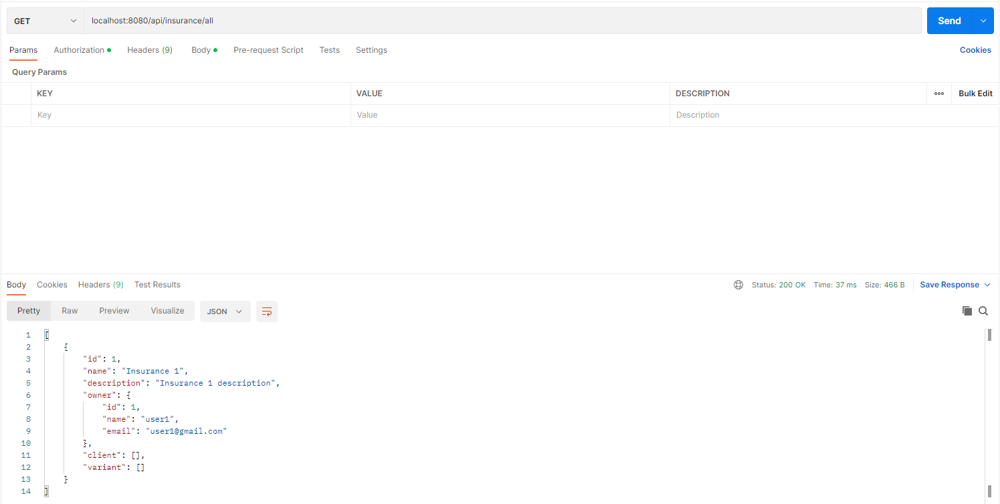
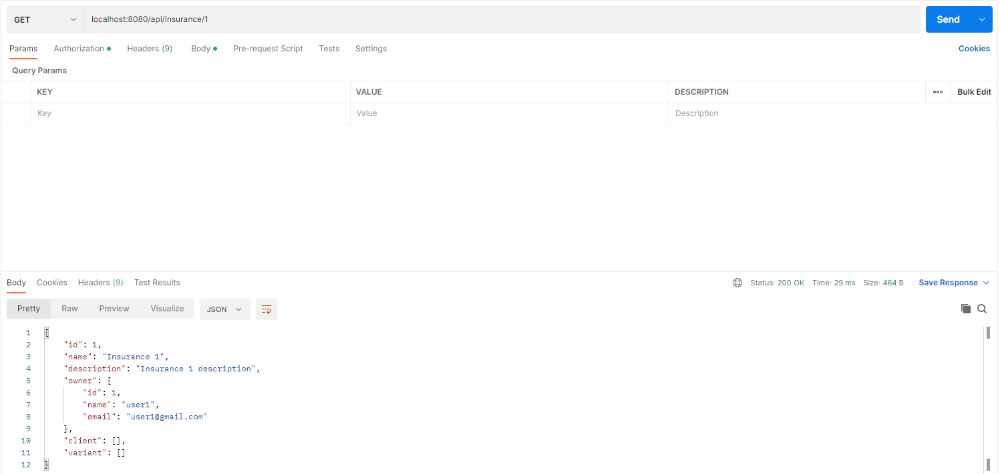

# Programowanie aplikacji back-endowych

## Insurance Service zajmuje się obsługą typowych rzeczy związanych z ubezpieczeniami. Dodatkowo również w Insurance Service znajduje się rejestracja / logowanie użytkowników. Drugi serwis to Email Service zajmujący się rozsyłaniem wiadomości email.

### Aby uruchomić serwisy: `docker-compose up --build`

### Przykładowe zapytania do serwisów

#

#### Rejestracja

#### Rejestracja - wiadomość email

#### Logowanie

#### Logownie - wiadomość email

### Dodawanie ubezpieczenia

### Wszystkie ubezpieczenia

### Pobranie ubezpieczenia z id `1`

